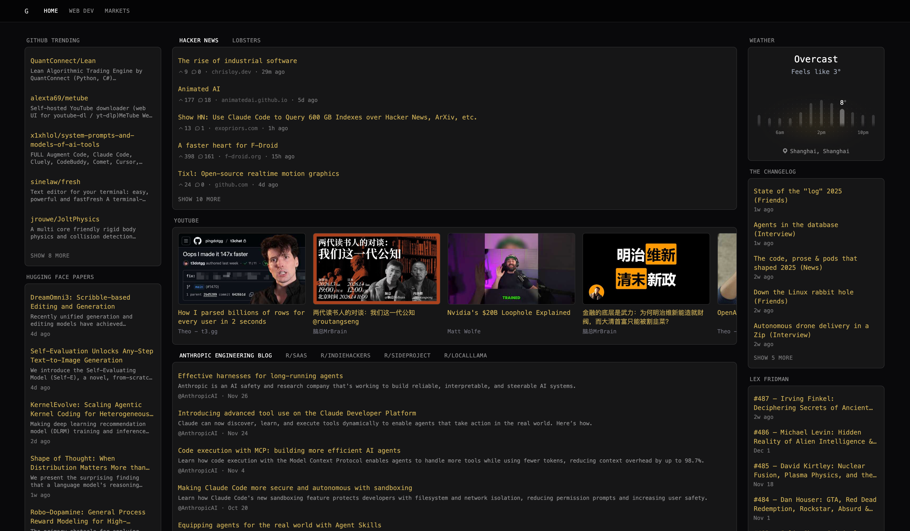

<div align="center">
  
  <h1>Gaze</h1>
  <p>
    <a href="#deployment">Deployment</a> ·
    <a href="CONFIG.md">Configuration</a>
  </p>
  <p>
  A Glance-like SSG (Static Site Generator) Dashboard built with Astro, React, and Tailwind CSS v4.
  </p>
</div>



## Architecture

**Pure SSG (Snapshot Model)** - Zero runtime fetch architecture:
- All data is fetched during build process via widget fetchers
- No client-side API calls
- Each widget has its own fetcher that runs during Astro build
- Data is embedded directly into static HTML

## Tech Stack

- **Core**: Astro (latest), React (Islands), TypeScript
- **Styling**: Tailwind CSS v4 (Oxide engine), Framer Motion
- **UI**: shadcn/ui, Magic UI, Lucide React icons
- **Layout**: CSS Grid-based Bento Grid (responsive)
- **Tooling**: Biome (Lint/Format), Bun (Runtime & Scripting)

## Getting Started

### Prerequisites

- [Bun](https://bun.sh) (latest version)

### Installation

```bash
# Install dependencies
bun install

# Start development server (fetches data automatically)
bun run dev

# Build for production (includes data fetching)
bun run build

# Preview production build
bun run preview
```

## Deployment

### GitHub Pages Setup

1. Fork this repository
2. **Enable GitHub Actions**: Go to the **Actions** tab in your forked repository and click **"I understand my workflows, go ahead and enable them"**
3. Go to **Settings → Pages** and set source to **GitHub Actions**
4. Push any change to trigger the deployment workflow

The site will be deployed to `https://<your-username>.github.io/gaze/`

**Note**: GitHub disables workflows in forked repositories by default for security reasons. You must manually enable them in step 2.

### Auto-Refresh Schedule

By default, the dashboard rebuilds every 6 hours to fetch fresh data. To change this schedule:

1. Edit [.github/workflows/deploy.yml](.github/workflows/deploy.yml#L8-L10)
2. Modify the `cron` expression in the `schedule` section:
   ```yaml
   schedule:
     - cron: '0 */6 * * *'  # Every 6 hours
   ```

Common schedules:
- Every hour: `'0 * * * *'`
- Every 3 hours: `'0 */3 * * *'`
- Every 12 hours: `'0 */12 * * *'`
- Daily at midnight UTC: `'0 0 * * *'`

Learn more about cron syntax at [crontab.guru](https://crontab.guru/).

## Configuration

Configure your dashboard in [src/config/gaze.ts](src/config/gaze.ts) using a declarative, type-safe approach.

### Quick Example

```typescript
export const gazeConfig = {
  pages: [
    {
      name: 'Home',
      width: 'wide',
      columns: [
        {
          size: 'small',
          widgets: [
            { type: 'weather', location: 'Shanghai' }
          ]
        },
        {
          size: 'full',
          widgets: [
            { type: 'hacker-news', limit: 15 }
          ]
        }
      ]
    }
  ]
} satisfies GazeConfig
```

### Documentation

📖 **[Configuration Guide (CONFIG.md)](CONFIG.md)** - Complete guide covering:
- Page layouts and column structures
- All available widgets with parameters
- Data structures and type definitions
- Complete examples and best practices

🔧 **[Widget Development (src/widgets/README.md)](src/widgets/README.md)** - Learn how to create custom widgets

### Available Widgets

**Layout Widgets**:
- [Group](CONFIG.md#group-widget) - Display widgets with tab navigation
- [Split Column](CONFIG.md#split-column-widget) - Place widgets side-by-side

**Content Widgets**:
- [Weather](CONFIG.md#weather-widget) - Current weather & 24-hour forecast
- [RSS](CONFIG.md#rss-widget) - RSS/Atom feed reader
- [YouTube](CONFIG.md#youtube-widget) - Recent videos from channels
- [Hacker News](CONFIG.md#hacker-news-widget) - Top stories from HN
- [Lobsters](CONFIG.md#lobsters-widget) - Posts from Lobsters community

### Architecture

The dashboard uses a **pure SSG (Static Site Generator) architecture**:
- ✅ All data fetched during build time (`bun run build` or `bun run dev`)
- ✅ Zero runtime fetch - no client-side API calls
- ✅ Parallel widget data fetching (max 10 concurrent)
- ✅ Graceful error handling - failed widgets show error state

## Project Structure

```
gaze/
├── src/
│   ├── components/     # React components (BentoGrid, etc.)
│   ├── config/         # Dashboard configuration
│   ├── layouts/        # Astro layouts
│   ├── lib/            # Utility functions (widgetData.ts)
│   ├── pages/          # Astro pages (index.astro)
│   ├── styles/         # Global styles & Tailwind config
│   └── widgets/        # Widget definitions (component + fetcher)
├── public/             # Static assets
└── astro.config.mjs    # Astro configuration
```

## Design Theme

- **Dark Mode** by default
- **Glassmorphism** effect (blur, subtle borders)
- **Instant load** (static HTML)
- **Animated transitions** via Framer Motion

## Development

### Linting & Formatting

```bash
# Check code quality
bun run lint

# Format code
bun run format

# Check and fix
bun run check
```

## Use as Browser New Tab Page

You can set your deployed Gaze dashboard as your browser's new tab page using the **New Tab Redirect** Chrome extension:

1. Install [New Tab Redirect](https://chrome.google.com/webstore/detail/new-tab-redirect/icpgjfneehieebagbmdbhnlpiopdcmna) from Chrome Web Store
2. Click the extension icon and go to **Options**
3. In the **Redirect URL** field, enter your GitHub Pages URL (e.g., `https://yourusername.github.io/gaze/`)
4. Click **Save**

Now every new tab will open your personalized Gaze dashboard.

## License

MIT
